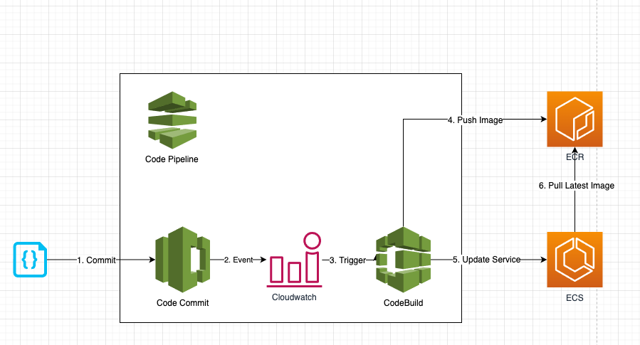
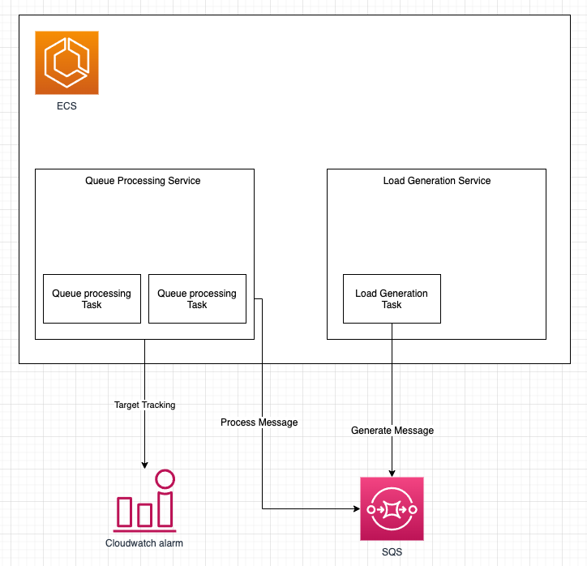
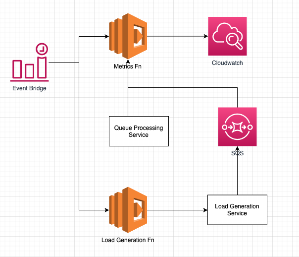
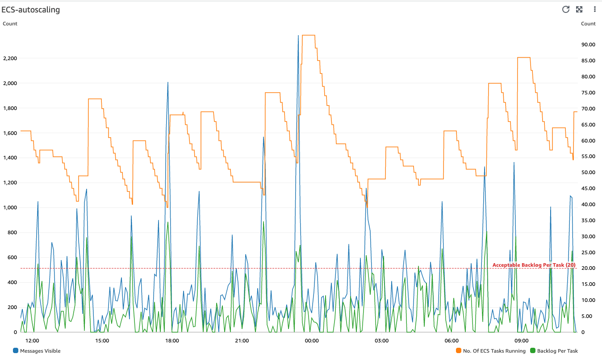
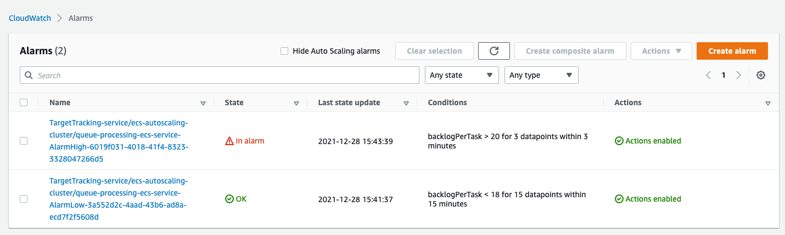

# AWS ECS auto-scaling with custom metrics (i.e. backlogPerTask)

## Background

Amazon ECS typically measures service utilization based on CPU and memory average utilization and publishes them as predefined CloudWatch metrics, namely, *ECSServiceAverageCPUUtilization* and *ECSServiceAverageMemoryUtilization*. Application Auto Scaling uses these predefined metrics in conjunction with scaling policies to proportionally scale the number of tasks in a service. 

**However, there are several use cases where customers want to scale the number of tasks on other custom metrics to trigger when and to what degree to a scaling action should be executed.**

## Objective

1. Build a CI/CD pipeline that builds the latest image and trigger a deployment to ECS Service
2. Auto-scale ECS Queue Processing service using target scaling with custom metrics, backlogPerTask
3. Set up a scheduled cron job to trigger a lambda function to publish backlogPerTask metrics

## Testing

1. Set up a Load Generation service to report on SQS attributes 
2. Set up a scheduled cron job to generate random loads to an SQS queue

## Important note

1. This is a reference architecture and may not be suitable for production use.

## Security

See [CONTRIBUTING](CONTRIBUTING.md#security-issue-notifications) for more information.

## License

This library is licensed under the MIT-0 License. See the LICENSE file.


# Getting started

## Pre-requisite

```
npm install -g cdk
npm install -g node-jq
```
## Clone repository

```
> git clone https://github.com/aws-samples/aws-ecs-auto-scaling-with-custom-metrics
> cd ecs-autoscaling
> git submodule init  
> git submodule update
```


## Create CI/CD Pipeline

```
> cd ecs-autoscaling/cdk-resource
> npm install 
> npm run cdk:deploy:CodePipelineResourceStack

Outputs:
CodePipelineResourceStack.codeCommitRepositoryUrlGrc = codecommit::<region>://queue-processing-codecommit-repo
CodePipelineResourceStack.ecrRepositoryName = queue-processing-ecr-repo

Stack ARN:
arn:aws:cloudformation:ap-southeast-1:<account id>:stack/CodePipelineResourceStack/<stack id>
```

## Build container image

```
> cd ecs-autoscaling/queue-processing-node-app  
> git remote add codecommit $(cat ../aws-outputs.json | jq ".CodePipelineResourceStack.codeCommitRepositoryUrlGrc" -r)
> git push codecommit main
```

## Deploy ECS Resource and Lambda Stack

```
> cd ecs-autoscaling/cdk-resoruce
> npm run cdk:deploy 
...
Do you wish to deploy these changes (y/n)? y

// To see the status of your SQS attributes
> echo $(cat ../aws-outputs.json | jq ".ECSResourceStack.LoadBalancedFargateServiceServiceURLA3D7F0DD" -r)
```

# Implementation details
## PART 1: CI/CD Pipeline

### Components

[](https://drawio.corp.amazon.com?lightbox=1&highlight=0000ff&edit=_blank&layers=1&nav=1&title=ecs-autoscaling.drawio#R7VpZc9s2EP41eoyG9%2FEYUnLjGXfqqZNp2pcOREIUGlJgQciS%2FOu7IMGbOhyJPsaNH0IsDi722%2F12AWqi%2B8nuF4bS1a80xPFEU8LdRJ9NNE3VNAv%2BE5K9lKiaW0giRkIpqwUP5AlLoSKlGxLirDWQUxpzkraFAV2vccBbMsQY3baHLWncfmuKItwTPAQo7kv%2FICFfFVLHVGr5F0yiVflmVZE9CSoHS0G2QiHdNkT6fKL7jFJePCU7H8fCeqVdink3B3orxRhe83MmUKbxr8vfUsu6Nbzbb1%2FW%2F2p%2FfdKKVR5RvJEblsryfWkBRjfrEItFlInubVeE44cUBaJ3C6CDbMWTGFoqPMrlMON4d1BPtdo9%2BA2mCeZsD0PKCY40mHQZ3TaL9ra2v1GOWTVsr5egIIl5VK1dmwUepGWeYSW1ZyUfPB0k9yTFMVnDoxWDFt6CwVPEK0M0zEg3XIz0Kz8V1gxRtqpMK6xGwPPu0ALH9zQjnNA19C0o5zRpDPgck0h0cCqsj2QrAPti1oYDfC4V7092kYjPKdpm%2BjQA3dNScd1bkjj2aUxZridY2%2FWFaTyYERJYs%2Bxb03z4FRCuQkIibJQx00DYsqdmH2JHHQlh63Qc4BCIQTYp4ysa0TWK57XUa0dKPeaOCqByQP7BnO8ly6ENp0PRI1503LKgF92wAB%2FZkC65ErEI8yPjjGGkGI4RJ49tPYasLqfeUwIa1jFsVvBJjC3TaS9SaCbnddCrFPl5QO0eoOoU2j5NEsJ72IIv8zYUvajqBl9CwrBAHWfkCS3ypQTuqdhSvknTm5gzkMQioD0U%2FIhyD2kE2zL%2FdyyqZF6T69fZpOkThz36YAh%2BUqaq4jgtiMpkcCn2g4uW8%2BlymeFRENdPh%2FBJhm04wJlkm3FGf%2BAOR3YoVVG8%2BY02RMdPG4ZzPv4bpuDSeTCbP%2BLCh66UU%2FU24VqqOh1IqoOUO1pSdXt4aSJC862%2Fc%2FI1ziRf50Lyvcj%2BxqGi5gBHvq0CJiiUfJXypRNNptsvX2xrKJZcfawC9Qzye4EQAgOy%2FXc5P2%2F8KRpTQ3VLwWzX7J7tm617zAjYQ%2FhALrxiRDpnRqR6APoLc6JpGFPFcl3N0WzHchyrTcd65S0nqqPPjKF9Y5isNY68t0P8ut3xtWLFqyZitc8sumD2r4xEEYD7AYqvIh6PVV%2B64hjtQsm4SvVlTxW7s27Xt8YrwZx%2BSonpJtwiHqzOyydLWjM2QAR%2FN8fYvEP%2Bnq%2FqpnWoKhs7VwndJTWqWtmW%2BxWvRFlabHRJdkKPwWJvIOEZUxQjllypEuxwj%2BnaA6Wg7fSTl%2B0c9sXLkpf9zss9tbyYPJldDhzKnhfzz04CdvucZ%2Bju%2BEmgLEAaXGCIJHC%2FyYAKlNtE3Lt%2BhExgHw1HqI2qwPpZ5h%2Bf11X3w0Toqx7JyoUbQWOKoPmWhoiLo9kDZo8k%2BBiB454qoRRTa%2FHaGNdXnekjhtjwNwZvQ%2BLw3X1dWORav8bZvHvgeQtn8%2F63hbn%2F%2B3XLYei7sZ25YjT6ZoTBQgXIa0G%2FfUBmiulDgurWy83AfnNF82CBDByWp4DbQOgjKK14ao%2FCAbuOl9nO6Q9YL1pCV9%2BY322CPvuC5tIS%2BjI79%2B%2FZrKKqzefeQZbO%2BEcqbxu%2FZBgub9XyavJKH5lePC%2F37zTm%2FsP%2F7P0a7J2Nw96jXoFAs%2F6JT%2BGU9S%2Bl9Pl%2F)

### How it works

1. A change or commit to the code in the CodeCommit application repository triggers CodePipeline with the help of a CloudWatch event.
2. The pipeline downloads the code from the CodeCommit repository, initiates the Build and Test action using CodeBuild, and pushes the image on to a ECR repository.
3. If the preceding step is successful, a post-build triggers a deployment to update ECS service using the latest container image

## PART 2: ECS resources

### Components

[](https://drawio.corp.amazon.com?lightbox=1&highlight=0000ff&edit=_blank&layers=1&nav=1&title=ecs-autoscaling.drawio#R5Vldc5s6EP01fowHJMD4sWCnzUw6Tce5cz%2FeFJBBDSAq5Njur68EawyW7XFuycT3NnmItFpW0tmzu5IywmG%2B%2BShImX7mMc1GyIo3IzwbIWQj5Kk%2FWrIFiY2mjSQRLAbZXrBgPygILZCuWEyrnqLkPJOs7AsjXhQ0kj0ZEYKv%2B2pLnvVnLUlCDcEiIpkp%2FZPFMm2kvmvt5Z8oS9LdzLYFIznZKYOgSknM1x0Rno9wKDiXTSvfhDTT6O1wab67PTHaLkzQQl7yARdIPi6%2FlJ535wR3f3wqvqN%2FbpDbmHkh2Qp2DKuV2x0Egq%2BKmGor1ggH65RJuihJpEfXyutKlso8Uz1bNcEcFZJuTi7UbreviEN5TqXYKhX4YAqAAWWQD%2F31Hn9vJ0s72DsYhAR8nrSm97CoBiDzGpQcA6V5uDCA4iuZsYKGLRU1XkteyJBnXNQ6WP3e6pmDRJCY0d7Y7cSfW05nbMaEMsR4ocYLLvTugyXLss43M8sN7YmSV1LwZ9oZWdY%2FaiQmVdq6T3uGKXrfkyeaPfCKgfknLiXPOwofMpboAcm1hwn0IrUqKvou1zuEwLXRrg%2Bo6ClJVTZwLNlGryNQkVDqwXyT6KwxJuvKGQta8ZWI6F2k1xOobtPqa9GoGoZktt1nGbZMlk18k2Q72eAcw7bBsUciEiqV7FGQ6JkVicE4GqtkBV3ND57wgmTzvTToB%2B9e555rv9b%2B%2B0al3IIDyUryYwGtJzqPtFpX7b9zYQTYyWZfZ7CwjvtO0IxI9tJfyfDR7hue%2BLqiqomsB8EjWlW1K6wFFS9MbRh5JNcxUjxVZQvYv82fx8PvDQjvTEzCo8mRtNqW4uGBnp4EuuwC%2FUiq53evSjbq4%2BcdSRitThc%2F763g25W7Dnxhxlfxmsgo1RNmROTDFqmCF9SsQUFoY9czahAoX135KTnTVuYvylgFRo6WpAbAQdiDLK%2FHHt9573KDDPLccxIryUdaUEFqv3Ry3FXmtDaHXU9Ow95%2FvEhjfGmRdt%2BzSOOJwV8gri4fn1Xt0Be7Q1coqsk%2BckZmOSRrzuK4cRKt2A%2Fy1OaVOo3U23KDkTtTkkwntUAd1ZLaocfO4idJD%2FdXsD9qb41dF54h3MkQscZ44gInL%2FYMWHvQO%2Byo8OWy0ufRA9e1k%2F6CN%2FFF2egqDgLO9OoOAv575By6YfKvTvtvbWrsQm%2B2Act1ZwudAfPU5ZeJX81T9acfhCDbjgJEvxkswBLsH7AEH7zOHOofsuqV%2Br4%2FPeBRs%2BJhw9Q8sMON6DfLuf7ZDHFjjS00RT3%2F3DhXn4PNR67rvY0h9%2BqSsPmSuvj6Bm%2BE2HF89Lo3whP3s%2F%2FrG2H1faA3Qte2%2BznWfbNLm%2Bru%2FxPQRPT%2BHyp4%2FhM%3D)

### How it works

1. The load generation service will artificially generate random load to a sqs queue
2. The queue processing service will process the messages from the SQS queue
3. The queue processing service leverage on target tracking scaling policy with custom metrics, backlogPerTask to calculate the desired no. of task running

## PART 3: Lambda resources

### Components

[](https://drawio.corp.amazon.com?lightbox=1&highlight=0000ff&edit=_blank&layers=1&nav=1&title=ecs-autoscaling.drawio#R7VnbcpswEP0aP9YDAmH7MbZzm0mmybidXl4yCsigVmaJkG%2F9%2BkpGGDBO4jQ4pDOJH4KOVrDsObsryx1nNFudC5JE1xBQ3kFWsOo44w5CNkKe%2BqeRtUFsNMiQULDAYAUwYX%2BoAS2DzllA04qhBOCSJVXQhzimvqxgRAhYVs2mwKtPTUhIa8DEJ7yOfmOBjDK0j60Cv6AsjPIn25aZmZHc2ABpRAJYliDntOOMBIDMrmarEeU6enlcsnVnj8xuHRM0locsAIHkl%2BnnxPMu3eHl14v4Af385DrGObnO35gGKgBmCEJGEEJM%2BGmBDgXM44Dq21pqVNhcASQKtBX4i0q5NmySuQQFRXLGzazyWKy%2Fm%2FWbwQ896OJ8OF6VJ8fr8uiGCjajkgoDZi%2BgvX40MAZKYS58%2BlQ0DFWSiJDKpwztLYFK%2BhSUP2KtFgrKiWSLqifESDDc2hUsqQtD1EtIcz9I%2BxfSUKukGTcXhM%2FNo04X%2BmWRNVSVTwVil1OYS85iOtpWNh24KcRyBBzExsZRnzPtxDAUJGC0mIsh1qxPGecl8%2BHIdrCn8FQK%2BE13jAOSRluFLKiQTNXBK3JP%2BQ2kTDKI1dw9SAmzksEJZ6GekFpHQ2JGvvJFs11WkPbdyMtG%2Bdi8r34kSZPsRadspf0YJsD0XTZxSs1NVBlN9ILZKtQtp0uWqdul2uJOKond3ZN0s9ZEWzlJV09rrK4Is6BnKDO9CztmvCwaQa%2BfQVGpB%2BRY8xLy2sj7JlM17%2BDPpipuNVXtWqpeqxszP1XgWXxYoh47mfbkgdPlZHYfkHren%2BE%2BdtzHy0QDybKbLW5vT7Z4XVzPl4FzLB4HNR7%2Fp8bZZOKhQxOv98rEM0tvdOUuxOGiLfNGHr0CyW%2BTOWdW7lC%2FdeUVakA1NVwBCRRyTmMqyCYlP%2FL70Pzuo%2FbzG9cYHXGYB0si%2FajZ7ZSOseO6fVSaGzOhbpQRHeu6cPB%2BS81MN3%2FvcdO1d4MlaFZjLn3tz1ANs6uqlV9EvxHNubWe0ssF1tYeDLfSQppsBb0DWwG29nPzslZwIgRZlww2W%2Fr0KPW9d1B9n1CxYH7921aVo2XEJJ0kZBPKpVL4Pj5ep21vUK2njrdH23ZeZcvi9qxjibuVg4UGxY3f7ADnGXHv3wZhVOXc2z2y27F3rP5T9uoi86DRPML1g4rJ7eSjnb59O00f0oZqzaDaRz2v5ZMM3Mqxc5OF5uCTjFYKTa1w4BcWGvwWhaZ%2BzHI7p%2BoSWTcCfJqmLA7fUcfe%2FQbk5elxhH6thsUvQ1nAix%2FYnNO%2F)

### How it works

1. The cron job triggers the metrics function to publish custom metrics, backlogPerTask every 5 minutes
2. The cron job triggers the load generation function to generate load to an SQS queue every 5 minutes

# FAQ

## Why do we want to use custom metrics, _backlogPerTask_ as a scaling metric instead of readily available SQS metrics, _ApproximateNumberOfMessagesVisible_?

If you use a target tracking scaling policy based on a custom Amazon SQS queue metric, dynamic scaling can adjust in response to the load change curve of your application more effectively.
CloudWatch Amazon SQS metric like ApproximateNumberOfMessagesVisible  (i.e. queue depth) for target tracking
does not change proportionally to the capacity of the ECS Service (i.e. number of tasks in running status) that processes messages from the queue.
That's because the number of messages in the SQS queue does not solely define the number of ECS tasks needed.

**The number of tasks in the ECS Service can be driven by multiple factors, including how long it takes to process a message and the acceptable amount of latency (i.e. queue delay).**

As such, we opted for the metric **backlog per task** with the target value being the **acceptable backlog per task** to maintain.

## How do we calculate the metric, _backlogPerTask_?

You can calculate these numbers as follows:

1. **Backlog per task**: To calculate your backlog per task, start with the ApproximateNumberOfMessages queue attribute to determine the length of the SQS queue (number of messages available for retrieval from the queue). Divide that number by the fleet's running capacity, which for an ECS Service is the number of tasks in the Running state, to get the backlog per task.
2. **Acceptable backlog per task**: To calculate your target value, first determine what your application can accept in terms of latency. Then, take the acceptable latency value and divide it by the average time that an ECS task takes to process a message.

To illustrate with an example, let's say that the current ApproximateNumberOfMessages is 1500 and the fleet's running capacity is 10 ECS tasks. If the average processing time is 0.1 seconds for each message and the longest acceptable latency is 10 seconds, then the acceptable backlog per task is 10 / 0.1, which equals 100 (messages/task).
This means that 100 is the target value for your target tracking policy.
If the backlog per task is currently at 150 (1500 / 10), your fleet scales out, and it scales out by five tasks to maintain proportion to the target value.

## How do I change the desired latency/processing time per jobs ?

```
> vim ecs-autoscaling/cdk-resources/lib/global.json

// Edit the keys: acceptableLatencyInSeconds, averageProcessingTimePerJobInSeconds
{
  "acceptableLatencyInSeconds": "10",
  "averageProcessingTimePerJobInSeconds": "0.5",
  "codebuildName": "queue-processing-codebuild-project",
  "codeCommitRepositoryName": "queue-processing-codecommit-repo",
  "codepipelineName": "queue-processing-codepipeline",
  "ecrRepositoryName": "queue-processing-ecr-repo",
  "ecsClusterName": "ecs-autoscaling-cluster",
  "ecsFargateLoadGenerationServiceName": "load-generation-ecs-service",
  "ecsFargateQueueProcessingServiceName": "queue-processing-ecs-service",
  "imageTagVersion": "latest",
  "queueName": "queue-processing-queue",
  "metricName": "backlogPerTask",
  "metricNamespace": "queue-processing-lambda-metrics",
  "metricUnit": "Count",
  "ecsTargetTrackingPolicyName": "auto-scaling-using-avg-backlog-per-task"
}

```


# Screenshots

## Cloudwatch dashboard



## Target tracking alarm




